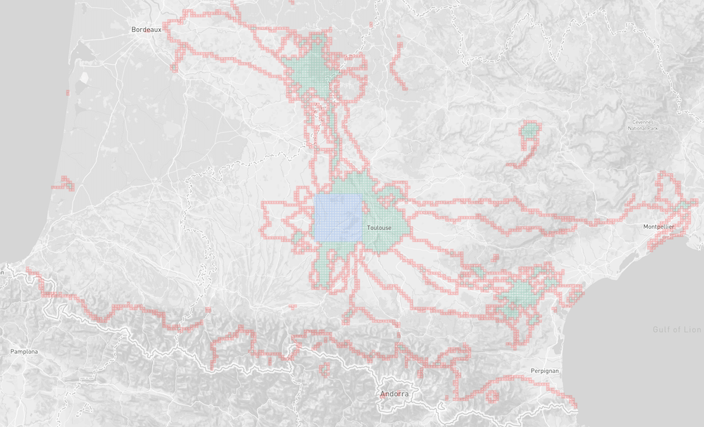

# gatsby-source-statshunters

[![Npm version][badge-npm]][npm]
[![Npm downloads][badge-npm-dl]][npm]
[![MIT license][badge-licence]](./LICENCE.md)
[![PRs welcome][badge-prs-welcome]](#contributing)

`gatsby-source-statshunters` is a [Gatsby](https://www.gatsbyjs.org/) plugin to use [StatsHunters](https://www.statshunters.com) as a data source and display explorer tiles.

[What are StatsHunters explorer tiles?](https://www.statshunters.com/faq-10-what-are-explorer-tiles)

## Usage

1. Download `gatsby-source-statshunters` from the NPM registry:

```shell
yarn add gatsby-source-statshunters
```

2. Add the plugin in your `gatsby-config.js` file

ℹ️ Login to [StatsHunters](https://www.statshunters.com) and copy the API key from the [settings page](https://www.statshunters.com/settings).

```js
module.exports = {
  plugins: [
    {
      resolve: "gatsby-source-statshunters",
      options: {
        api_key: process.env.STATSHUNTERS_KEY,
      },
    },
  ],
}
```

3. query data and enjoy

```
statsHunters {
  square
  tiles
  cluster
}
```

`square`, `tiles` and `cluster` are arrays of `[lat,lng]` coordinates.

4. Display your tiles with your favorite map library



You can checkout how to use it in the [example](./example/src/pages/index.js) folder.

## Contributing

- ⇄ Pull/Merge requests and ★ Stars are always welcome.
- For bugs and feature requests, please [create an issue][github-issue].

## License

This project is licensed under the MIT License - see the
[LICENCE](./LICENCE.md) file for details

## Thanks

I wanted to thank Stan Ansems once again for making [StatsHunters](https://www.statshunters.com) and allowing me to use the api to create this plugin. If you like statshunters, consider [making a donation](https://www.statshunters.com/donate)

[badge-npm]: https://img.shields.io/npm/v/gatsby-source-statshunters.svg?style=flat-square
[badge-npm-dl]: https://img.shields.io/npm/dt/gatsby-source-statshunters.svg?style=flat-square
[badge-licence]: https://img.shields.io/badge/license-MIT-blue.svg?style=flat-square
[badge-prs-welcome]: https://img.shields.io/badge/PRs-welcome-brightgreen.svg?style=flat-square
[npm-badge]: https://img.shields.io/npm/v/gatsby-source-statshunters.svg?style=flat-square
[npm]: https://www.npmjs.org/package/gatsby-source-statshunters
[github-issue]: https://github.com/cedricdelpoux/gatsby-source-statshunters/issues/new
